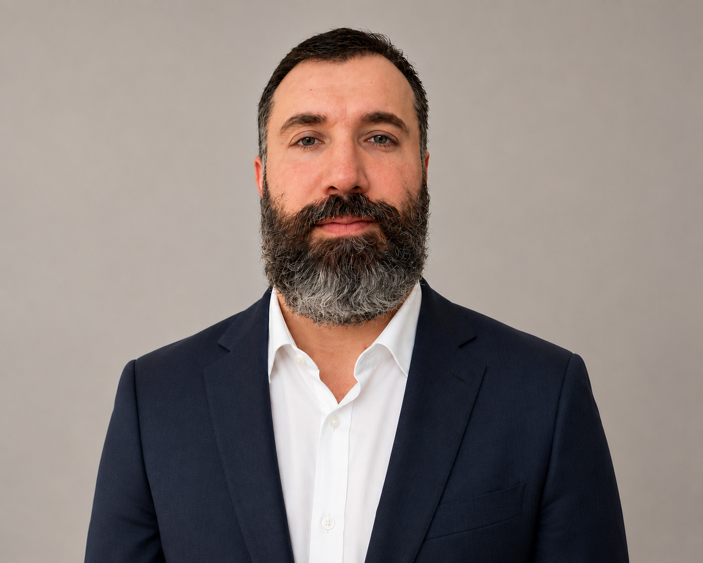

 

## FPGA developer and Electronics Hardware Designer based in Sweden      
[Email](mailto:emadmojaveri@gmail.com) / [LinkedIn](https://www.linkedin.com/in/emadmojaveri)

  

 
 
## Summary

I am an enthusiastic electronics designer with a keen interest in mathematics, electronics circuits, FPGA architecture, and signal processing. With a master’s degree in electronics engineering, specializing in circuits and systems, I have contributed to academic research and industrial design projects across several countries, including Taiwan and Hong Kong, before relocating to Sweden. During my time as an FPGA developer, I worked with a variety of families, including Altera, Xilinx's Spartan 3, Spartan 6, Artix-7, and Zynq series.

I created numerous AXI-based communication modules and test benches for FPGAs. In addition, I've created testbenches using open-source frameworks such as OSVVM, VUnit, and the UVVM framework, which include reusable verification components (VCs), bus functional models (BFMs), and advanced logging/assertions for FPGA RTL verification and image processing with FPGAs. VHDL was used to implement and verify a simple RISC-V RV32I core. I also created Wishbone-compatible RTL modules and TBs for point-to-point and shared bus topologies. Python RTL models were created in cocotb, interfacing VHDL/Verilog DUTs for reference checks and self-testing. Implemented and verified a custom 256-point fixed-point FFT (radix-2 DIT) in VHDL, including state-machine control, twiddle generation, and comprehensive testbench validation.

In addition to hardware development, I created numerous high-speed communication data acquisition I/O boards based on the Xilinx and Altera FPGA families. This required a schematic design and layout of a multi-layer PCB to ensure optimal power and signal integrity. To fine-tune the platform for peak performance, I performed testing, debugging, and hardware-in-the-loop verification.

 

## Project Highlights			

With hands-on experience in FPGA & embedded systems, hardware design, and hardware-in-the-loop (HIL) testing, including lab validation with oscilloscopes, logic analyzers, and measurement instruments, I am enthusiastic about applying my skills to advance any innovation and automation solutions. In my previous projects, I have worked extensively with FPGA platforms to implement complex algorithms for HVDC ‘s data acquisition and verification. This background in robotics and system integration has equipped me with strong capabilities in debugging and optimizing hardware and software interactions, skills that are directly relevant to the challenges of high-speed processing.

I have attached a few pictures from my past sorting robotic projects (that was planned to be camera added in the next phase - 2018) to provide a glimpse of my hands-on work and technical proficiency. I am eager to bring this practical experience and passion to any team and contribute to pushing the limits of current technologies.

 
	 
	 
	 
	 

 
	 
	 

 

These images capture a later stage of my FPGA development works, when I moved from system-level prototyping to signal-level verification and analysis. At this point, I focused on pulse detection behavior, FFT, increase FIR / IIR filter speed, moving-average filtering, AM modulation response, and asynchronous FIFO reliability under timing constraints. This phase helped me strengthen my workflow in waveform interpretation, debugging, and verification-driven RTL refinement.

 
	 

 
	 

 
	 

 
	 

 
	 

 

## Research Interest 													 
- FPGA, CoS & ASIC devices
  
- VLSI & low-power design
  
- Real-Time system & software Co-Design
  
- Digital signal & image processing
  
- High-speed circuits and PCB design
  
- Bio-electronics & Bioinstrumentation circuits and systems
  
- Hardware-in-the-Loop test & verification

 

## Peer-Reviewed Journal													
- Erfan Abbasian, Shilpi Birla, and Emad Mojaveri, [Design and Investigation of Stability- and Power-Improved 11T SRAM Cell for Low-Power Devices](https://doi.org/10.1002/cta.3364) International Journal of Circuit Theory and Applications (IJCTA), 2022.
 

## Working Experiences
- FPGA developer & Electronics Hardware Designer @ [HitachiEnergy](https://www.hitachienergy.com/), Sweden  _(May 2022 - Peresent)_		

- FPGA Designer & Electronics Hardware Research Assistant	@ [City University of Hong Kong](https://www.cityu.edu.hk/en), Hong Kong SAR	_(Oct. 2020 to Mar. 2022)_

- Electronics System Researcher @	[National Chiao Tung University](https://www.nycu.edu.tw/nycu/en), Hsinchu City / Taiwan	_(Jan. 2020 to Sep. 2020)_													

- Electronics System Research Assistant @ Smart Control Developing Technology Co. (Imam Khomeini International University - IKIU), Qazvin Province / Iran  _(Jun. 2018  to Sep. 2019)_

- Electronics Hardware & System Designer	@ Subar Science & Technology Co. (MatsaJet), Guilan Province / Iran	_(Apr. 2016 to Feb. 2018)_

- Electrical Expert	@ Antique Co., Guilan Province, Iran	_(Apr. 2014 to Jan. 2016)_

- Automation & Instrumentation Technical Expert	@ Khazar Steel Complex, Guilan Province / Iran _(Sep. 2013 to Feb. 2014)_
  
 

## Education
- M.Sc. & B.Sc. Electrical Engineering - Electronics

 

## Languages

- English (Fluent)	

- Swedish (Basic Level)     

- Persian (native speaker)

